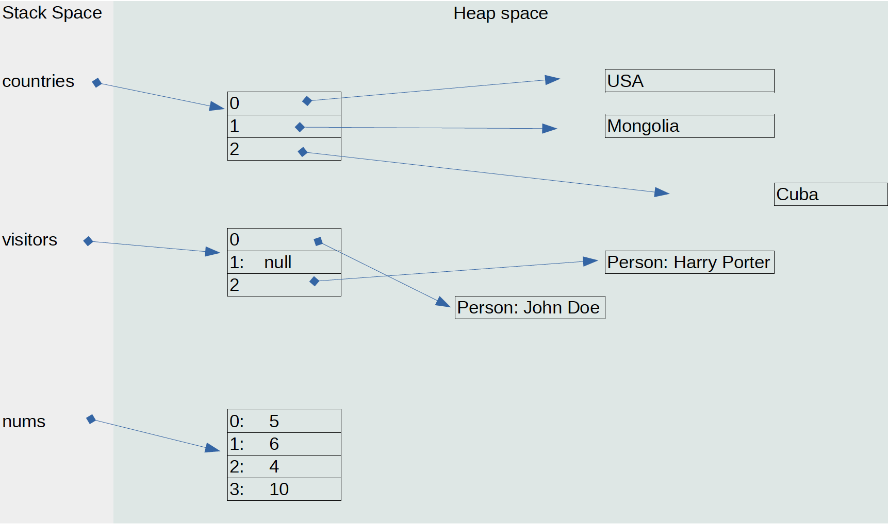

## Hello World

Today I will introduce Java Array data structure and some useful tricks to work with array as first release of this newsletter.

### Array
Array is one of most fundamental data structure in computer science. You can assume an _array_ as sequence of elements in the memory. 

Arrays have fixed size because the elements are located sequentially in the memory and java needs to know how much space it should allocate to the arrays. If they had dynamic size, some conflict would have happened in the memory when new space was allocated.

#### Creating array
You can create new array in three ways in Java
```java
//This will give you array of String with size 3.
String[] countries={"USA","Mongolia","Cuba"};

//This will give you array of Person with size 3.
Person[] visitors=new Person[3];
visitor[0]=new Person("John Doe");
visitor[2]=new Person("Harry Potter");

//This will give you array of int with size 4.
int[] nums=new int[]{5,6,4,10};

```
This arrays looks like below in the memory.



#### Default values
When you create an array, java will set default values for all elements of it. 
```java
//numerical arrays of primitive elements will be created with element value 0
//{0,0,0,0,0}
int[] i=new int[5];

//{0.0, 0.0, 0.0, 0.0}
double[] d=new double[4];

//boolean arrays will be created with false values.
//{false, false, false}
boolean[] bool=new boolean[3];

//Object arrays will be created with null values.
//{null,null,null,null}
String[] str=new String[4];

//{null,null}
Person[] p=new Person[2];
```

#### Arrays class
Java provides us various unility functions to work with arrays through [java.util.Arrays](https://docs.oracle.com/en/java/javase/11/docs/api/java.base/java/util/Arrays.html) class. Here are some of very useful functions.


```java
/* Filling an array with value */
// a=[0,0,0,0,0,0,0]
int[] a=new int[7];
// a=[8,8,8,8,8,8,8]
Arrays.fill(a,8);

/* Comparing two arrays */
// b=[8,6,5,4,9,1,10]
int[] b=new int[]{8,6,5,4,9,1,10};

// compareResult is greater than 0 
//because 8 is greater than 6 (which are second elements of the arrays)
int compareResult=Arrays.compare(a,b);

// compareResult is less than 0 
//because 6 is less than 8 (which are second elements of the arrays)
compareResult=Arrays.compare(b,a);

// b=[8,8,8,8,8,8,8]
Arrays.fill(b,8);
// compareResult is 0 because two arays are equal now
compareResult=Arrays.compare(a,b);

// true because two arrays are element wise equal. 
//Note: It is not DeepEqual so use Arrays.deepEquals if you compare arrays of Object
boolean isEqual=Arrays.equals(a,b);

int[] c={6,4,2,5,7,8,5,2,10,2};

// Sorting array
// c=[ 2, 2, 2, 4, 5, 5, 6, 7, 8, 10 ]
Arrays.sort(c);

// Searching elements from sorted array
// Note: This function will work only on sorted array because of the algorithm.
// indexOfElement=4
int indexOfElement=Arrays.binarySearch(c,5);

// indexOfElement=8
indexOfElement=Arrays.binarySearch(c,8);

// indexOfElements=-1
// because the array does not contain 1
indexOfElement=Arrays.binarySearch(c,1);
```

To learn the other functions and their use, visit [Official JavaDoc](https://docs.oracle.com/en/java/javase/11/docs/api/java.base/java/util/Arrays.html)

## What is happening in Java World

Just few days ago, JDK 14 released. You can know about what is added or removed in Java from [release note](https://jdk.java.net/14/release-notes)

The most relevant for us so far is that [NullPointerException](https://docs.oracle.com/en/java/javase/11/docs/api/java.base/java/lang/NullPointerException.html) gives us more detailed and helpful message and it would make debugging lot easier. [Read More](https://openjdk.java.net/jeps/358)

Before this release NullPointerException's message was something like
```
Exception in thread "main" java.lang.NullPointerException
    at Prog.main(Prog.java:5)
```

In JDK 14, this message will look like
```
Exception in thread "main" java.lang.NullPointerException: 
        Cannot assign field "i" because "a" is null
    at Prog.main(Prog.java:5)
```

Another interesting api is added as preview feature is new class named [Record](https://openjdk.java.net/jeps/359)