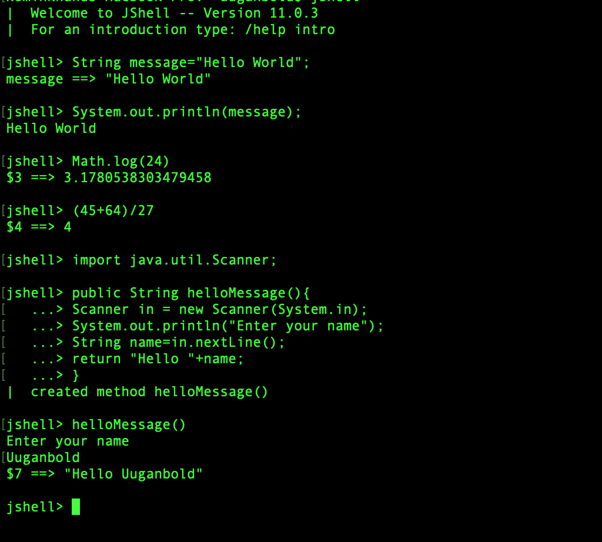

## Java Is Cool 

Java is Cool because it was Cool and it is becoming Cooler. Since jdk8 java has evolved extensively and introduced many new features to meet nowadays requirements. So today I will introduce some of new Java tools and features that may be useful so far.

### JShell

JShell is Read-Evaluate-Print Loop (REPL) which first appeared in the JDK 9. REPL is a tool that evaluates your code print the result immediately as you write. It means you do not need to create a java file and compile it to run a small piece of code or to check a simple statement now.

To start JShell, you run `jshell` on your terminal and then you can run code as seen below.
<p></p>

### Run Single-file program without compilation.

Generally running java code takes two steps:

1. Compiling java code with `javac` command and it creates _class_ file.  
   ```javac JavaIsCool.java```
2. Run compiled class with `java` command 
   ```java JavaIsCool```

Fortunately, since JDK11 you do not need to compile Single-file java code to run it.
`java JavaIsCool.java`


### Lambda expressions and Stream API 

Maybe the most excinting new features are the **Stream API** and **Lambda expressions** introduced in JDK8. With these two concept, Java has *functional programming* possibility. Stream API gives Java power to perform *bulk operations* on the sequence of elements. Lambda expression gives Java a way to treat a function apart from object. 

I will leave it just mentioning about it because it should probably be separate newletter itself.

### New String methods

Maybe an API we use the most is String and it has many new functionality which would make our life easier. 

```java
// String.repeat() just repeats string. @JDK11
// ones="1111111111";
String ones="1".repeat(10);

//String.isBlank() checks if the string is empty or contains only blank spaces. @JDK11
"1".isBlank(); //false
"   ".isBlank(); //true
"    3   ".isBlank()   //false
"".isBlank()   //true

//String.strip(), String.stripLeading(), String.stripHeading() remove
// leading and/or trailing white spaces. @JDK11
// "Java"
"    Java     ".strip();
//"Java     "
"    Java     ".stripLeading();
//"    Java"
"    Java     ".stripTrailing();


//String.lines() gives us a way to process multi-line text as a Stream. @JDK11
/*
I like Java
Why do you like Java
Because Java is Cool
*/
String someText="   I like Python  \n   I like Java   \n  Why do you like Java  \n   Because Java is Cool  ";
someText.lines().map(String::strip).filter(s->s.contains("Java")).forEach(System.out::println)


//String.transform(). @JDK12
//It transforms a string into new string with the help of function passed.

//"   Java is cool    " -> "Java is cool" -> "Java"
"   Java is cool    ".transform(String::strip).
    transform(s->{
        return s.substring(0,s.indexOf(" "));
    })


//String.indent(): Adjusts the indentation of each line of this string. @JDK12
// myText="    Java\n    Is\n    Cool"
String myText="Java\nIs\nCool".indent(4);
// myText="  Java\n  Is\n  Cool"
myText=myText.indent(-2);
// myText="  Java\n  Is\n  Cool"
myText=myText.indent(0);
// myText="Java\nIs\nCool"
myText=myText.indent(-2);

```


